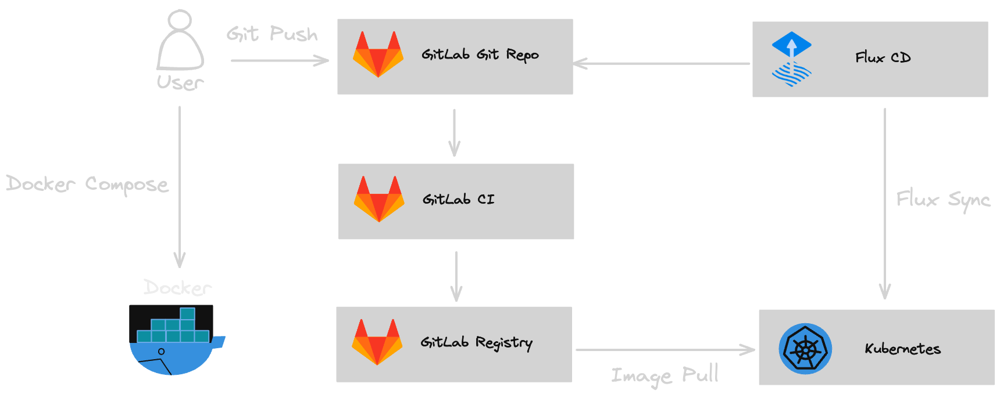

# CI/CD Pipeline for Kuberentes with Gitlab-CI and FluxCD

In this project we will setup a CI/CD pipeline to build the Spring PetClinic Sample Application and deploy it to a Kubernetes cluster. You can also use it as template to build and deploy other applications. 



## Pre-requisites
1. Docker and Docker Compose
2. Kubernetes Cluster
3. [Helm](https://helm.sh/docs/intro/install/)
4. [Spring PetClinic Sample Application](https://github.com/spring-projects/spring-petclinic)
5. [GitLab](https://docs.gitlab.com/charts/installation/)
6. [FluxCD](https://fluxcd.io/)
7. [Cert-manager](https://cert-manager.io/docs/installation/)

## Structure

- `spring-petclinic/`: Folder contains the Spring PetClinic Sample Application project.
    - `Dockerfile`: Dockerfile with instructions on how to build the application image.
    - `compose.yml`: Docker compose file used to build application image and run the container.
    - `kustomize/deployment.yml`: kubernetes deployment manifest
    - `kustomize/service.yml`: kubernetes service manifest
    - `kustomize/ingress.yml`: kubernetes ingress manifest
    - `kustomize/kustomization.yml`: kubernetes kustomization manifest used by flux
- `gitlab/`: Folder contains GitLab configuration.
    - `values.yml`: Values file for GitLab Helm Chart installtion.
    - `issuer.yml`: Creates an issuer used to issue GitLab self-signed certificates.
- `flux/`: Folder contains Flux source and kustomization configuration.
    - `flux/clusters/nebula-west/spring-petclinic-kustomization.yml`: kustomization for PetClinic kubernetes deployment.
    - `flux/clusters/nebula-west/spring-petclinic-source.yml`: Defines Git repository source for the PetClinic application.
## Local Development
#### Clone Spring PetClinic Sample Application Git Repo, create *Dockerfile* and *compose.yml* files.
```
git clone https://github.com/spring-projects/spring-petclinic
cd spring-petclinic
touch Dockerfile
touch compose.yml
```

#### Build, run and test the application.
```
docker compose -f compose.yml up -d --build
```
You can then access the Petclinic at http://localhost:8080/.

## Continuous Integration
#### Install cert-manger and the gitlab issuer
```
cd ..
kubectl apply -f https://github.com/cert-manager/cert-manager/releases/download/v1.13.3/cert-manager.yaml
kubectl create namespace gitlab
kubectl --namespace gitlab apply -f gitlab/issuer.yml
```

#### Create a secret containing the issuer Certificate Authority. This secret is required by the gitlab-runners to verify the certificate of GitLab.
```
# Save the certificate to gitlab/gitlab-ca.crt
kubectl --namespace gitlab get secret nebula-west-tls  -ojsonpath='{.data.ca\.crt}' | base64 --decode > gitlab/gitlab-ca.crt

# Create a secret from the gitlab/gitlab-ca.crt
kubectl --namespace gitlab create secret generic gitlab-nebula-west-k8s-lab-tls --from-file=gitlab.nebula-west.k8s.lab.crt=gitlab/gitlab-ca.crt 
```
#### Install GitLab.
```
helm repo add gitlab https://charts.gitlab.io/
helm install gitlab gitlab/gitlab --namespace gitlab -f gitlab/values.yml
kubectl --namespace gitlab get pods

# Get initial root password
kubectl get secret gitlab-gitlab-initial-root-password -ojsonpath='{.data.password}' | base64 --decode ; echo
```
1. Login to gitlab at gitlab.nebula-west.k8s.lab with admin/[initial-root-password]
2. Create a user
3. Login with new user
4. Create a new empty-project named *spring-petclinic* 
5. Set new origin for the spring-petclinic project and push it to GitLab
```
cd spring-petclinic
git remote set-url origin https://gitlab.nebula-west.k8s.lab/YOUR_USER_NAME/spring-petclinic.git

# Verify
git remote -v

# Push repo
git push origin main
```
## Continuous Delivery
#### Add *.gitlab-ci* file to *spring-petclinic* project directory and define pipeline rules.
```
cd spring-petclinic
touch .gitlab-ci
```
Define the stages of the CI/CD pipeline in the *.gitlab.ci* file. 

If any non-inbuilt variables, like GITLAB_TOKEN are used in the *.gitlab.ci* file make sure to set the values for these variables in GitLab under Settings > CI/CD > Variables. 
```
# Commit changes
git add . && git commit -m "add .gitlab-ci" 

# Push repo
git push origin main
```
1. Login to gitlab and check the running job. 
2. Check that the continaer image has been pushed to the registry after successfull job completion
## Continuous Deployment

#### Make sure to configure the kuberntes cluster with the gitlab registry.

#### Create kubernetes manifest files and add the yaml.
```
touch kustomize/deployment.yml
touch kustomize/service.yml
touch kustomize/ingress.yml
touch kustomize/kustomization.yml


# Commit changes
git add . && git commit -m "add kustomize manifests" 

# Push repo
git push origin main
```

#### Install FluxCD.
1. Login to GitLab and create an access token.
2. Export GITLAB_TOKEN and GITLAB_USER environment variables
```
export GITLAB_TOKEN=YOUR_ACCESS_TOKENS
export GITLAB_USER=YOU_GITLAB_USERNAME
```
3. Install FluxCD
```
# Install Flux CLI
brew install fluxcd/tap/flux

# Run pre check
flux check --pre

# Install FluxCD
flux bootstrap gitlab \
--hostname=gitlab.nebula-west.k8s.lab \
--owner=$GITLAB_USER \
--repository=flux \
--branch=main \
--path=./clusters/nebula-west \
--personal --ca-file=../gitlab/gitlab-ca.crt
```

#### Create Petclinic repository.
```
# Clone the newly create *flux* repo 
git clone https://gitlab.nebula-west.k8s.lab/YOU_GITLAB_USERNAME/flux.git
cd flux

# Create credentials secret for Git Repo
kubectl -n flux-system  create secret generic gitlab-credentials --from-file=ca.crt=../gitlab/gitlab-ca.crt --from-literal=username=$GITLAB_USER --from-literal=password=$GITLAB_TOKEN

# Create flux sourece manifest
flux create source git spring-petclinic \
--url=https://gitlab.nebula-west.k8s.lab/YOU_GITLAB_USERNAME/spring-petclinic.git \
--branch=main \
--interval=1m \
--secret-ref=gitlab-credentials \
--export > ./clusters/nebula-west/spring-petclinic-source.yml

# Commit changes
git add -A && git commit -m "Add spring-petclinic GitRepository"

# Push to flux repo
git push
```

#### Create Petclinic kustomization.
```
# Clone the newly create *flux* repo 
git clone https://gitlab.nebula-west.k8s.lab/YOU_GITLAB_USERNAME/flux.git
cd flux

# Create flux sourece manifest
flux create kustomization spring-petclinic \
--target-namespace=petclinic \
--source=spring-petclinic \
--path="./kustomize" --prune=true  \
--wait=true --interval=30m \
--retry-interval=2m \
--health-check-timeout=3m \
--export > ./clusters/nebula-west/spring-petclinic-kustomization.yml

# Commit changes
 git add -A && git commit -m "Add spring-petclinic Kustomization"

# Push to flux repo
git push
```
#### Run the CI job again and wathc the kubernetes cluster for the new deployment.
```
kubectl create namespace petclinic
flux get kustomizations --watch

# Verify and Troubleshoot
kubectl --namespace flux-system get Kustomization
kubectl --namespace flux-system get GitRepository 

kubectl --namespace petclinic get all
```
Changes made to the spring-petclinic Kubernetes manifests in the main branch are reflected in your cluster.